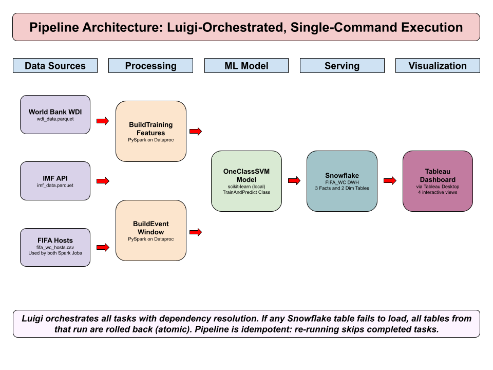

# Should We Accept the Bid? — FIFA World Cup Hosting Decision Support Tool

**MSBA 405 · Team 1 · UCLA Anderson**

Hans Grunwald, Anay Mehta, Yash Khadilkar, Zahid Ahmed, Matheus Kina, Mubarak Alkharafi

---
## Overview

This project builds a data-driven decision support tool for the FIFA World Cup hosting committee. It ingests economic indicator data from the World Bank (WDI) and IMF, evaluates countries across key development indicators using machine learning, and surfaces historical pre/post hosting impacts through an interactive Tableau dashboard connected to Snowflake. The tool helps the committee assess which candidate nations have economic profiles most consistent with successful past hosts.

The full pipeline is orchestrated by Luigi and runs end-to-end with a single command:

```bash
bash run_pipeline.sh
```

This script creates a Dataproc cluster, runs all pipeline tasks, loads Snowflake, and deletes the cluster automatically.

## Pipeline


The pipeline flows left to right through five stages:

**Data Sources (GCS):** World Bank WDI (8.4M rows), IMF API (553K rows), and a curated FIFA hosts CSV (33 entries) are stored as Parquet and CSV in Google Cloud Storage.

**Processing (Dataproc):** Two PySpark jobs run on a Dataproc cluster. BuildTrainingFeatures joins WDI + IMF + hosts, computes 6-year pre-event averages, pivots to wide format, and filters correlated indicators at a 0.90 threshold (output: 33 rows, ~177 indicators). BuildEventWindow builds indicator time series from t-6 to t+6 relative to each host's tournament year (output: 172,249 rows).

**ML Model (local):** TrainAndPredict trains a SVM Model (scikit-learn) on host country profiles and scores all countries on hosting similarity (output: 208 country scores).

**Serving (Snowflake):** LoadSnowflake loads three fact tables into the FACTS schema with atomic rollback: if any table fails, all tables from that run are dropped. LoadDimensions then populates the DIMENSIONS schema with DIM_COUNTRY and DIM_INDICATOR using the World Bank API for human-readable names.

**Visualization (Tableau):** A Tableau dashboard connects to Snowflake and provides interactive exploration of hosting similarity and historical impact.


## Data Download and Ingestion

Raw data must be present in GCS before running the pipeline. The `ingest_imf.py` and `ingest_wdi.py` scripts should be run prior to store the necessary data in GCS buckets before running the pipeline. If the bucket is already populated (as it is for the demo video), skip this section. 

Additionally, a scripts folder should be created in GCS bucket to store all of the scripts for the data sources and processing phase, including `ingest_imf.py`, `ingest_wdi.py`, `build_event_windows.py`, and `build_training_features.py`.


## Quick Start

### 1. Prerequisites

**Software (install before running):**

```bash
pip install luigi snowflake-connector-python gcsfs pyarrow pandas numpy scikit-learn
```

You also need the Google Cloud SDK (`gcloud` CLI) authenticated to the `msba405-team-1` project:

```bash
gcloud auth login
gcloud config set project msba405-team-1
```

### 2. Set Snowflake Credentials

Export your Snowflake credentials in your terminal before running:

```bash
import snowflake.connector

conn = snowflake.connector.connect(
    account="your_account",
    user="your_username",
    password="your_password",
    database="FIFA_WC",
    warehouse="WC_WH",
    role="ACCOUNTADMIN",
)
cur = conn.cursor()

cur.execute("GRANT ALL PRIVILEGES ON SCHEMA FACTS TO ROLE PUBLIC")
cur.execute("GRANT ALL PRIVILEGES ON SCHEMA DIMENSIONS TO ROLE PUBLIC")
cur.execute("GRANT ALL PRIVILEGES ON SCHEMA ANALYTICS TO ROLE PUBLIC")

print("Done! Permissions granted.")
cur.close()
conn.close()
```

These stay in your terminal session only and are never committed to the repo.

### 3. Clear failed flags

Clear any failed flags if running the pipeline again.

```bash
!rm -f /tmp/luigi_*.flag
```


### 4. Verify Raw Data

The raw data must already be present in GCS. The `run_pipeline.sh` script checks for these files and will exit with a clear error if any are missing. See the "Data Download and Ingestion" section below if you need to populate the bucket from scratch.

### 5. Run the Pipeline

```bash
bash run_pipeline.sh
```

This single command:
1. Validates GCP authentication and Snowflake credentials
2. Clears any failed flags from previous pipeline run
3. Verifies raw data and scripts exist in GCS
4. Creates a Dataproc cluster (`msba405-prototype`)
5. Runs the full Luigi pipeline (sensors, Spark jobs, ML training, Snowflake load)
6. Deletes the Dataproc cluster (even if the pipeline fails, to save credits)

Expected runtime: ~25-30 minutes (cluster creation takes 2-3 min, Spark jobs ~10 min, model + Snowflake ~12-13 min).

⭐ Demo was run in Google Colab
